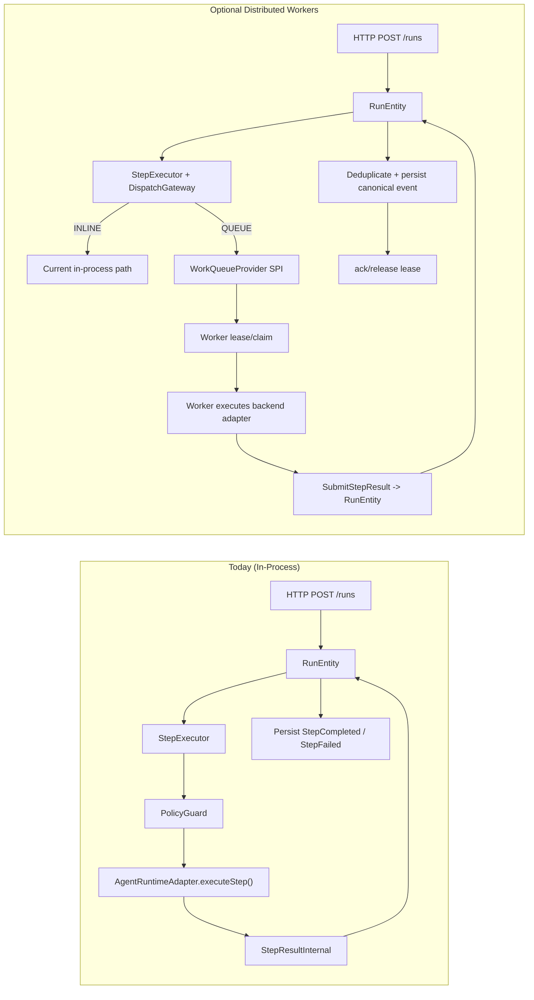

# Distributed Worker System (Optional Module) — Design Spec

## Status

Draft v1

## Goal

Add distributed step execution to Pekora as an **optional capability** without changing core workflow correctness guarantees.

- Keep `RunEntity` as canonical owner of run state and transitions.
- Preserve existing in-process execution as the default path.
- Support a pluggable queue/provider model so Pekko Reliable Delivery is the default implementation, but not the only one.

## Non-goals

- No direct worker mutation of run state.
- No provider-specific behavior leaking into `run-engine`.
- No required migration for existing users who want in-process execution only.

## Current Model (Baseline)

`StepExecutor` executes steps in-process via `AgentRuntimeAdapter`, then sends `StepResultInternal` back to `RunEntity` (via actor messaging/`pipeToSelf`).

## Proposed Model (Optional)

Introduce a dispatch plane between engine scheduling and step execution:

1. `RunEntity` schedules step (unchanged).
2. `StepExecutor` decides dispatch mode (`INLINE` or `QUEUE`).
3. `INLINE`: execute exactly as today.
4. `QUEUE`: publish `WorkItem` to a `WorkQueueProvider`.
5. Worker claims leased work, executes adapter/backend, reports result to engine.
6. `RunEntity` validates idempotency and persists canonical events.

## Architecture Diagram



## Design Principles

- **Optional by default**: disabled unless explicitly configured.
- **Canonical state ownership**: only `RunEntity` mutates run state.
- **At-least-once transport, exactly-once effect**: dedupe in engine using deterministic key.
- **Provider abstraction**: queue technology hidden behind SPI.
- **Safe rollout**: per-step/per-backend dispatch mode support.

## Module Boundaries

### Existing

- `runtime:run-engine`: scheduler, state machine, retries, idempotency.

### New (optional)

- `runtime:work-dispatch-core`
  - Provider-neutral contracts and data models.
  - Dispatch mode and policy interfaces.

- `runtime:work-dispatch-pekko`
  - Pekko Reliable Delivery provider implementation.
  - Framework default provider.

- `runtime:worker-runtime`
  - Worker lease/claim loop.
  - Adapter invocation and result submission.
  - Heartbeat/ack/release lifecycle.

### Future providers (optional)

- `runtime:work-dispatch-kafka`
- `runtime:work-dispatch-sqs`
- `runtime:work-dispatch-nats`

## Dependency Direction

```text
runtime:run-engine -> runtime:work-dispatch-core <- runtime:work-dispatch-pekko
runtime:worker-runtime -> runtime:work-dispatch-core
runtime:worker-runtime -> adapters/*
```

`run-engine` must not depend on provider modules directly.

## Core Contracts (v1)

### Dispatch mode

```kotlin
enum class DispatchMode {
  INLINE,
  QUEUE
}
```

### Work item payload

```kotlin
data class WorkItem(
  val workItemId: String,
  val runId: String,
  val stepId: String,
  val attempt: Int,
  val backend: String,
  val tenantId: String? = null,
  val capabilityTags: Set<String> = emptySet(),
  val input: Map<String, Any?>,
  val policySnapshot: Map<String, Any?>? = null,
  val createdAtEpochMs: Long,
  val leaseTimeoutMs: Long,
  val maxAttempts: Int
)
```

### Lease abstraction

```kotlin
data class LeasedWorkItem(
  val leaseId: String,
  val workerId: String,
  val leasedUntilEpochMs: Long,
  val item: WorkItem
)
```

### Queue/provider SPI

```kotlin
interface WorkQueueProvider {
  fun enqueue(item: WorkItem): CompletionStage<Unit>
  fun claim(workerId: String, limit: Int): CompletionStage<List<LeasedWorkItem>>
  fun heartbeat(leaseId: String, extendMs: Long): CompletionStage<Boolean>
  fun ack(leaseId: String): CompletionStage<Unit>
  fun release(leaseId: String, reason: String): CompletionStage<Unit>
}
```

### Result submission command

```kotlin
data class SubmitStepResult(
  val runId: String,
  val stepId: String,
  val attempt: Int,
  val workerId: String,
  val dedupeKey: String,
  val outcome: StepExecutionResult,
  val finishedAtEpochMs: Long
)
```

`dedupeKey` format (v1): `"$runId:$stepId:$attempt"`

## Engine-Side Rules

1. Queue delivery is treated as at-least-once.
2. `RunEntity` enforces exactly-once effect by dedupe key.
3. Queue `ack` occurs only after result acceptance or deterministic duplicate detection.
4. Retry policy is engine-owned (`maxAttempts`, backoff, jitter).
5. Lease expiration returns work to available state.
6. Workers never persist run state; they only execute and report.

## Run-Engine Integration Points

### `StepDispatchGateway` (new port in run-engine)

- `dispatch(stepContext): CompletionStage<DispatchDecision>`
- Chooses inline vs queue based on policy/config.

### `StepExecutor` behavior

- `INLINE`: preserve current execution path exactly.
- `QUEUE`: build `WorkItem`, enqueue, emit `StepDispatched` event/telemetry.

### `RunEntity` behavior

- Handle `SubmitStepResult` like current step result path.
- Validate dedupe key and attempt number.
- Persist canonical `StepCompleted`/`StepFailed` only once.

## Suggested Event Additions (v1)

- `StepDispatched(workItemId, stepId, attempt, backend)`
- `StepRetryScheduled(stepId, attempt, nextVisibleAtEpochMs)`
- `StepDeadLettered(stepId, attempt, reason)`

Optional for observability:

- `StepExecutionAccepted(dedupeKey, workerId)`
- `StepLeaseExpired(workItemId, attempt)`

## Configuration (Optional Feature Gate)

```yaml
pekora:
  distributedWorkers:
    enabled: false
    provider: pekko-reliable-delivery
    dispatchModeDefault: inline
    perBackend:
      langgraph: queue
      openclaw: inline
      strands: inline
      generic: inline
```

### Semantics

- `enabled: false`: no dispatch provider used; all steps run inline.
- `enabled: true`: dispatch mode policy is active.
- `dispatchModeDefault`: fallback when no backend or step override exists.
- `perBackend`: gradual migration/canary control.

## Failure Modes and Recovery

- Worker crash after claim, before result: lease expires, work is reclaimed.
- Worker submits duplicate result: engine dedupe returns idempotent success path.
- Queue/provider transient failure: enqueue/claim retried with bounded backoff.
- Poison step repeatedly fails: engine emits dead-letter event after max attempts.

## Security and Multi-Tenancy Notes

- Include `tenantId` and capability tags in `WorkItem` for provider-level routing.
- Workers should authenticate when submitting results.
- Result submission should validate run ownership/tenant match.

## Observability

Track at minimum:

- Queue depth / oldest age.
- Claim-to-start latency.
- Execution duration by backend.
- Lease expiration count.
- Duplicate submission count.
- Retry and dead-letter rates.

## Compatibility and Migration

- Existing deployments require no changes.
- Start with `enabled: false` default.
- Enable queue execution per backend for canary rollout.
- Keep inline path permanently as fallback.

## Open Questions

1. Should policy be re-evaluated in worker at execution time for defense in depth?
2. Should `policySnapshot` be required for audit reproducibility?
3. Do we need strict ordering constraints for steps targeting the same external resource?
4. Which provider capabilities are mandatory vs optional (visibility timeout, delayed delivery, priority)?

## Phased Implementation Plan

1. Add `work-dispatch-core` contracts and no-op inline gateway.
2. Integrate `StepDispatchGateway` into `run-engine` with no behavior change by default.
3. Add `work-dispatch-pekko` provider.
4. Add `worker-runtime` with one backend path.
5. Add per-backend dispatch config and metrics.
6. Document provider SPI and add second provider as proof of pluggability.

## ADR

- [ADR-0001: Optional Distributed Worker Execution](./adr/ADR-0001-optional-distributed-workers.md)
